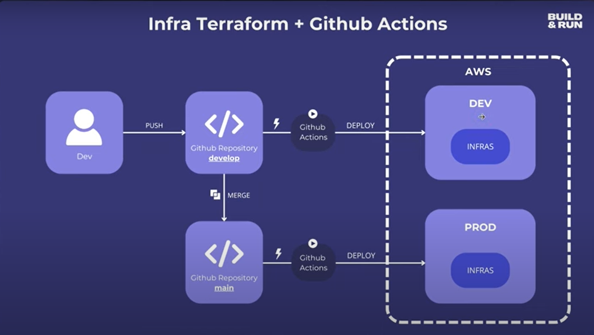
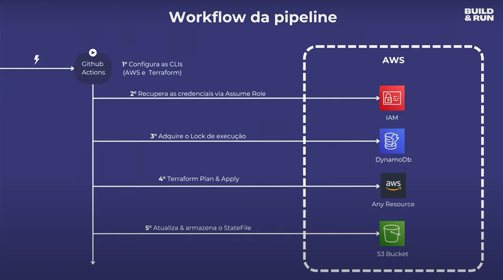
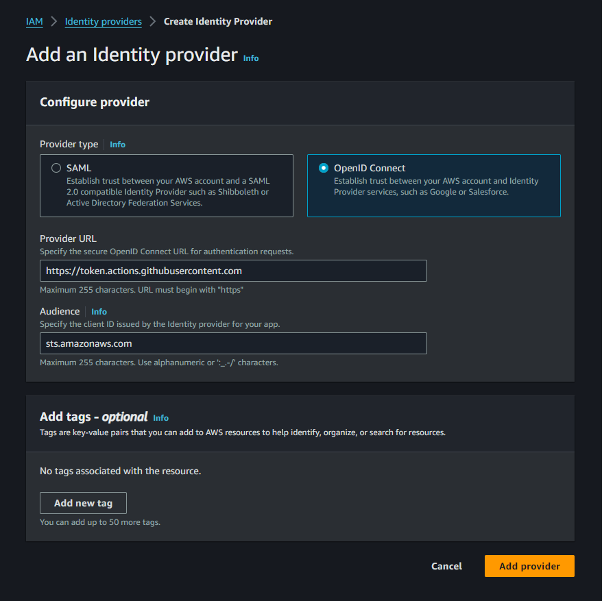
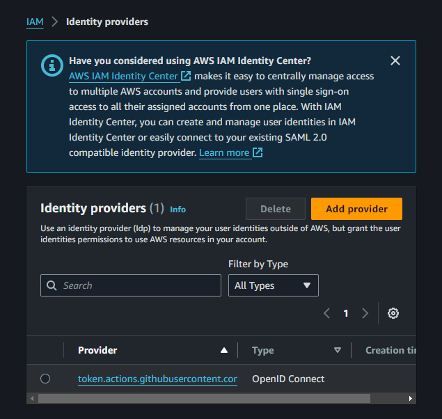
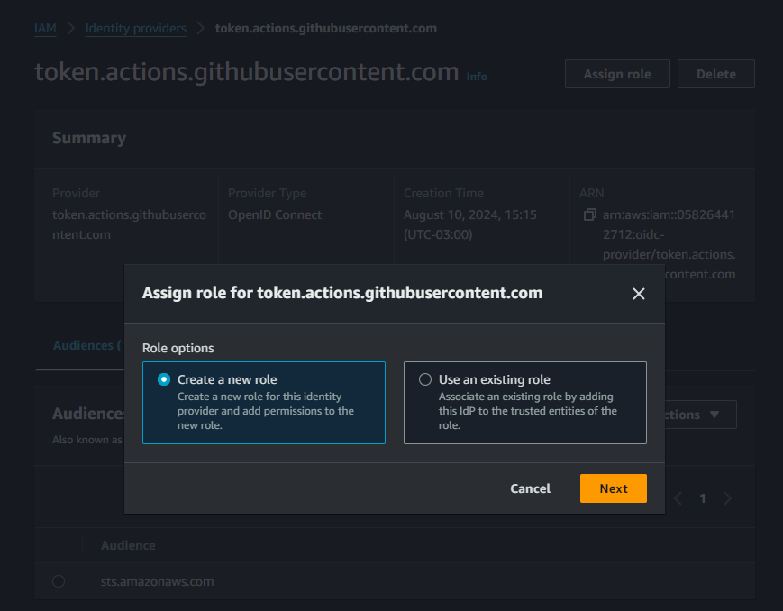
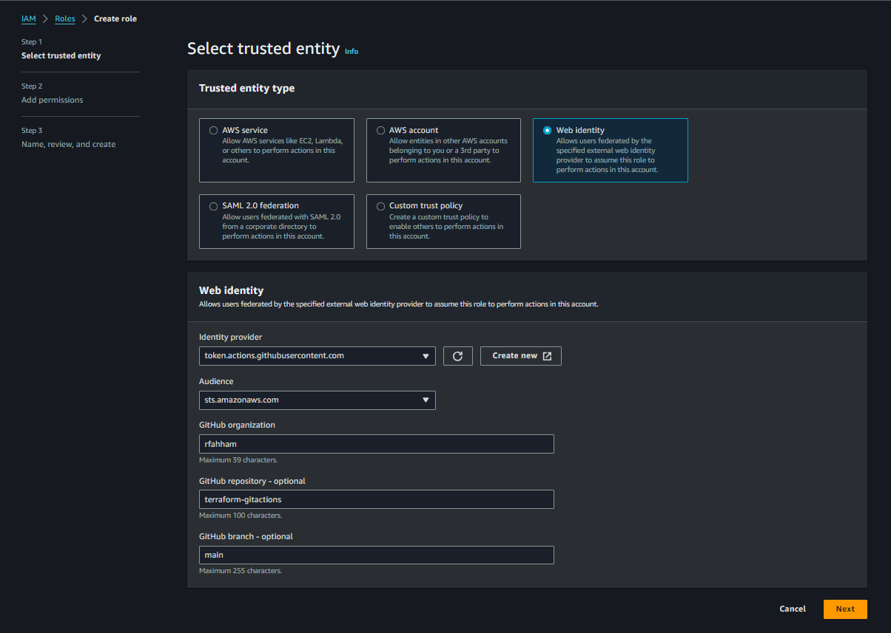
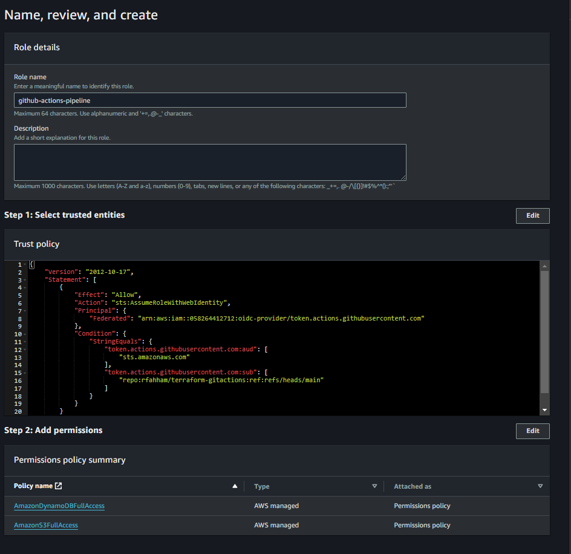
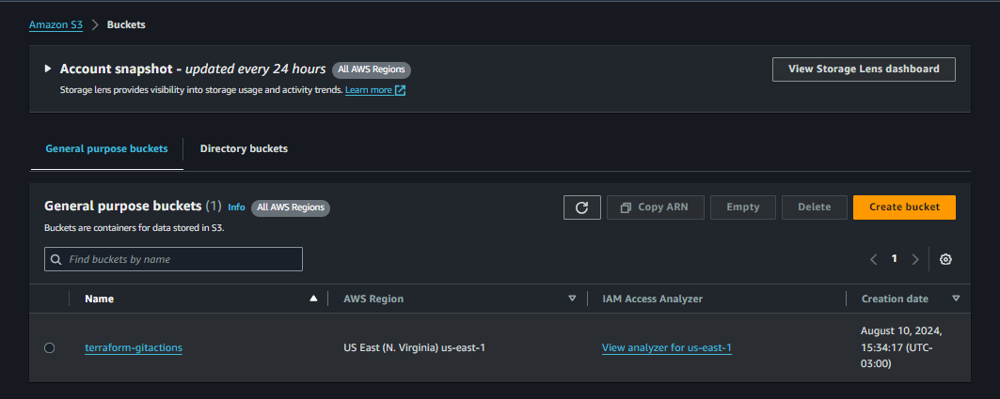

# terraform-gitactions

## Esquema

## 1 - Estrutura da Pipeline

Desenho da estrutura do pipeline

## Setup 

- Criar o repositório da pipeline de infra no github
- Escrever o código terraform que criará recursos na AWS

## Configurar conta na AWS

- Configurar a AWS IAM Role que será usada pela pipeline
- Configurar a Trust Relationship via OpenID
- Criar a Role

Criado

Assign Role

Select trusted entity

Add permissions

## Criação de bucket S3 (dev e prod)

Criar o Bucket S3 que armazenará os Statefiles do terraform

## Criar a tabela no DynamoDB 

Irá realizar o lock para modificações concorrentes

## Criar o Reusable Workflow de Terraform

Configurar os inputs do workflow

- env
- aws assume roel arn
- aws region
- aws s3 bucket statefile
- aws dynamodb table lock

Configurar o setup do workflow

- clonar o repositório
- Configurar a AWS CLI
- Configurar o Teraform CLI

Configurar o step Terraform init

Configurar o step Terraform Plan

Configurar o step Terraform Apply

Configurar o pipeline para ambiente de DEV:

- Configurar o reusable workflow do terraform (develop)
- Realizar a criação de um bucket S3 no ambiente de DEV

Configurar o pipeline para ambiente de Prod:

- Configurar o reusable workflow do terraform (main)
- Realizar a criação de um bucket S3 no ambiente de PROD

Configurar o Terraform Destroy

- Configurar o step do terraform destroy
- Ajustar is steps de plan e apply para considerar o destroy
- Realizar o destroy no ambiente de DEV
- Realizar o destroy no ambiente de PROD

fonte: https://www.youtube.com/watch?v=1TNAUW7_bC0